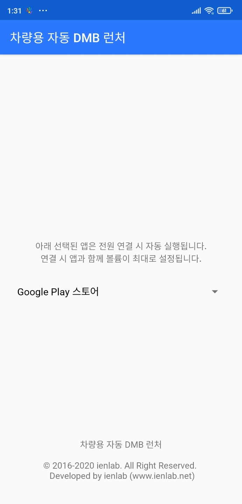
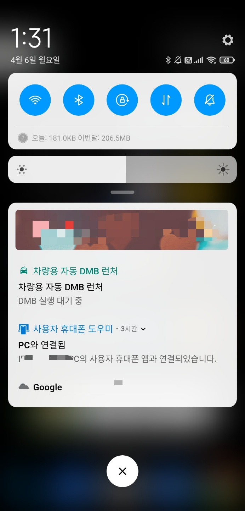

# 차량용 자동 DMB 런처

디벨로이드의 한 회원분이 어떤 글을 올리셨습니다.
https://cafe.naver.com/develoid/917859

전원이 연결되면 자동으로 DMB가 실행되고 볼륨이 최대로 되고,
전원이 연결 해제되면 홈으로 돌아가는 그런 앱 없나요?

생각해보니 그렇게 어렵지 않을 거라고 생각했습니다. 까먹지 않는다면 만든다고.
다시 생각나서 만들어 보았는데, 홈으로 돌아가려니까 시스템 권한이 필요하더군요.

이 앱은 /system/app 에 퍼미션 644 (rw-r--r--)를 필요로 합니다.
붙여넣기 후 재부팅하고, 실행하여 기기 관리자 권한을 허용해 주세요.

드롭다운 메뉴에서 앱을 선택해 주세요. 전원 연결 시 자동으로 앱이 실행됩니다.

[APK 다운로드](https://github.com/ericanorhee/AutoDmb/raw/master/app/release/app-release.apk)

